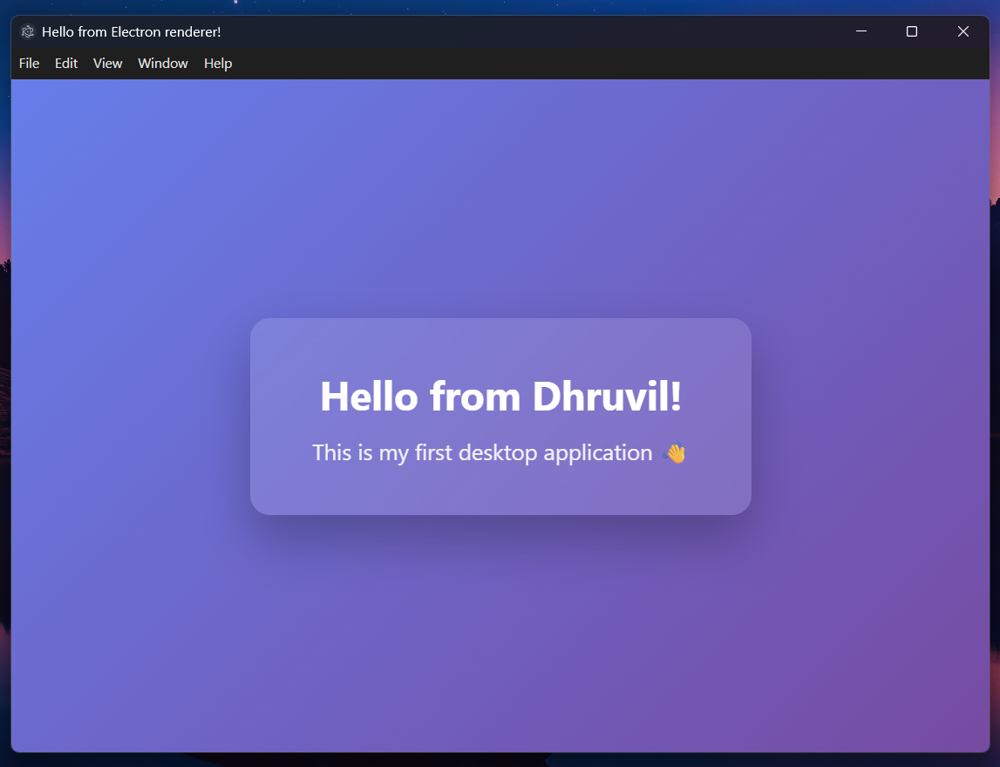

# Hello Dhruvil 👋

My first desktop application built using **Electron.js**.

## ✨ Features

- Simple and clean UI
- Fast desktop app
- Built with HTML, CSS, JavaScript, and Electron

## 🖥️ Download (Windows)

1. Go to **Releases**
2. Download `Hello Dhruvil-1.0.0-win.zip`
3. Extract the ZIP
4. Double-click `Hello Dhruvil.exe`

## 📸 Screenshot



## 🚀 Run Locally (For Developers)

```bash
npm install
npm start
```
